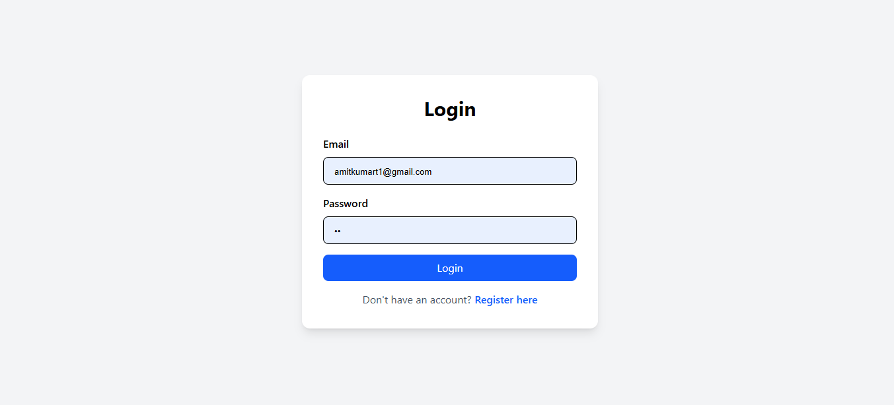
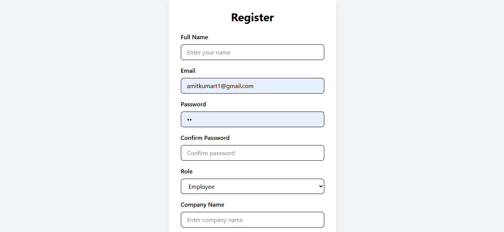
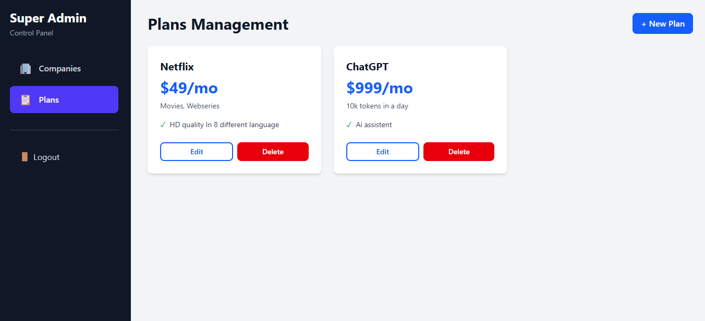

# 🚀 SaaS Subscription Management Platform

A full-stack SaaS-based Subscription Management System built using the MERN stack. This platform helps manage companies, employees, subscriptions, and roles with a scalable and modular architecture.

---

## 📌 Features

- 🔐 JWT Authentication & Authorization  
- 👨‍💼 Role-based access control (Admin / Company Admin / Employee)  
- 🏢 Company management system  
- 📦 Subscription plans management   
- 📊 Admin dashboard for monitoring system activity  
- 🔄 Full CRUD operations for all major modules  
- 📱 Responsive UI (React + Tailwind CSS)  
- ⚡ RESTful API integration between frontend and backend  

---

## 🛠️ Tech Stack

**Frontend:**
- React.js
- Tailwind CSS
- React Router DOM
- Axios

**Backend:**
- Node.js
- Express.js
- MongoDB
- Mongoose
- JWT (JSON Web Token)
- Bcrypt.js

---

## 📁 Project Structure
```
SaaS-Subscription-Management-Platform/
│
├── Back_end/
│ └── backend/
│ ├── routes/
│ ├── middleware/
│ ├── schema/
│ ├── models/
│ └── server.js
│
├── Frontend/
│ └── management-system/
│ ├── src/
│ │ ├── components/
│ │ ├── pages/
│ │ ├── layouts/
│ │ └── App.jsx
│ └── vite.config.js
```
screenshorts/Register.png
## 📸 Screenshots

### Login Page


### Dashboard


### Employee Panel

